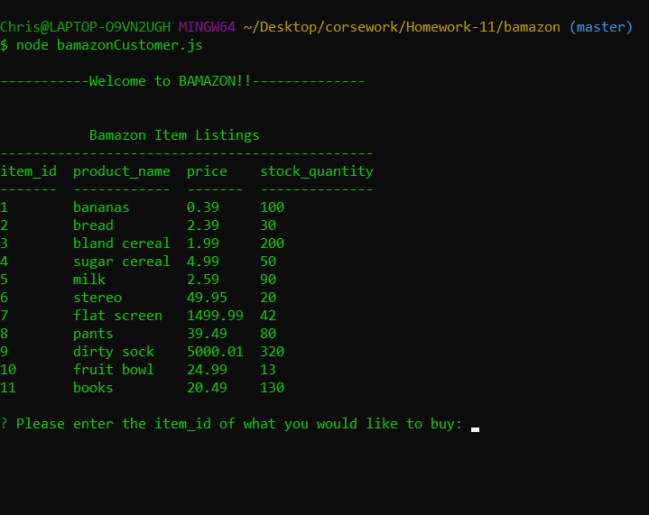
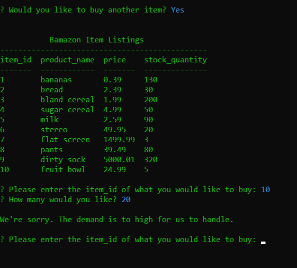
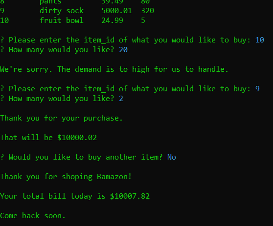

# bamazon

This is a CLI app that mimics a shopping experience. Using a premade MySQL table this has two parts:
* The customer file takes in orders from customers and depletes stock from the store's inventory.
* The manager file is able to manage the inventory by adding to the stock or adding a whole new item to the table

## bamazonCustomer.js
When the customer file is first loaded they see what items are available and are asked to enter the id number of the item they would like to buy. Then the amount of said item. Bamazon then shows the total of the current sale and asks if they would like to make another purchase.

Here we will select yes to show another feature. If the amount entered is higher then the amount available in the table the customer is notified and the process starts over.

Lets get a couple socks before we close out. When the customer choses to not buy anything else the total amount bought in the current session is displayed and disconects.

## bamazonManager.js