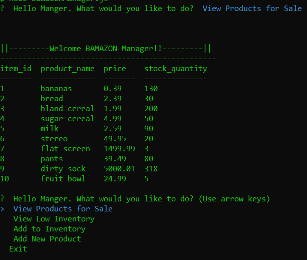
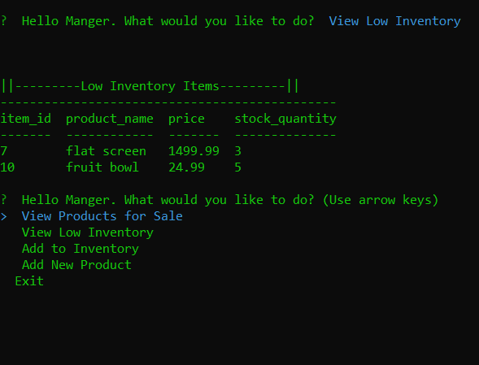
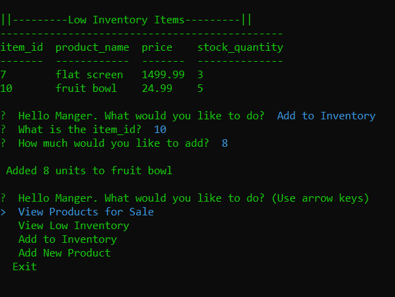
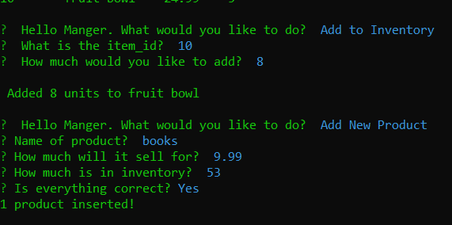
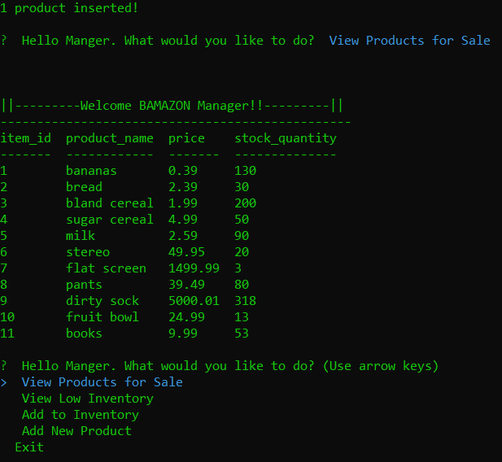

# BAMAZON

This is a CLI app that mimics a shopping experience. Using a premade MySQL table this has two parts:
* The customer file takes in orders from customers and depletes stock from the store's inventory.
* The manager file is able to manage the inventory by adding to the stock or adding a whole new item to the table

## bamazonCustomer.js
When the customer file is first loaded they see what items are available and are asked to enter the id number of the item they would like to buy. Then the amount of said item. Bamazon then shows the total of the current sale and asks if they would like to make another purchase.

Here we will select yes to show another feature. If the amount entered is higher then the amount available in the table the customer is notified and the process starts over.

Lets get a couple socks before we close out. When the customer choses to not buy anything else the total amount bought in the current session is displayed and disconects.

## bamazonManager.js

The manager file allows for a few tasks to be done. The first one just shows the table again. You should notice that the inventory has changed slightly from the first image.

**View low inventory** will display a table with items that have 5 or less units available.

**Add to inventory** will ask for the item id and how much should be added. Then displayes the additions

**Add New Product** will ask to enter the name, price, and how many there are of the item you would like to enter. After confirming what was entered is correct, and no errors, Bamazon will display that 1 product was inserted into the table.

Lets display the table again to see the new item added to the list. We did not need to add an id number because the MySQL table will auto generate these numbers.

**Exit** will simply end the connection to the table.

