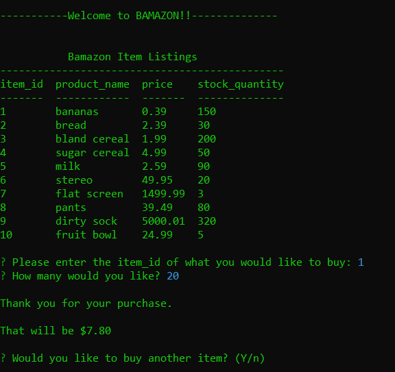

# bamazon

This is a CLI app that mimics a shopping experience. Using a premade MySQL table this has two parts:
*The customer file takes in orders from customers and depletes stock from the store's inventory.
*The manager file is able to manage the inventory by adding to the stock or adding a whole new item to the table

When the customer file is first loaded they see waht items are available and are asked what they would like to buy.

more text